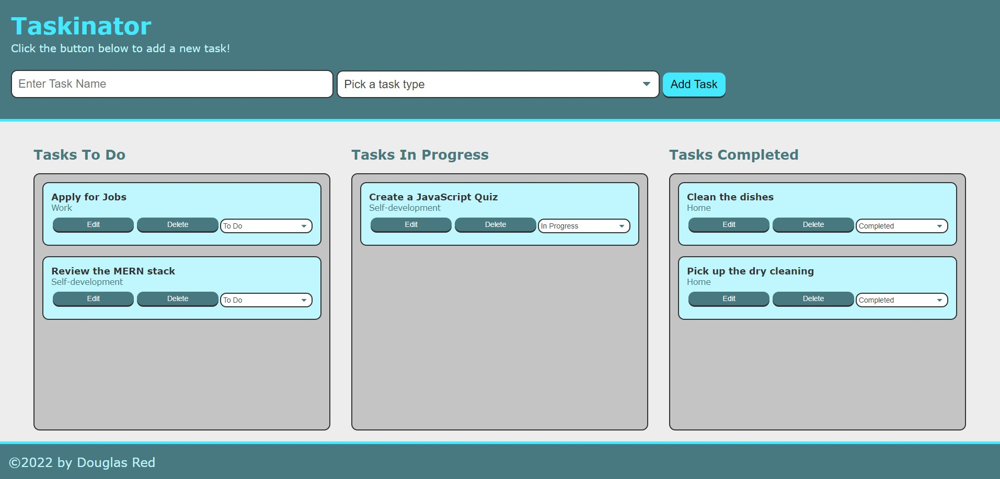

# Taskinator

## Table of Contents

- [Project Description](#Description)
- [Installation](#Installation)
- [Usage](#Usage)
- [Contact Me](#Contact)

## Description

### Motivation for creating this project

I wanted to practice my javascript skills by creating a website that will keep track of tasks.

### What problem does this solve?

This project is for the type of person that finds it satisfying checking things off of their to-do-list. For those who enjoy seeing progress being made.

## Installation

To use this project download this code on your computer, clone my repo from my GitHub page.

## Usage

Please view the screenshot below to see the Taskinator Website being utilized.

## Contact Me

Download my code for the Taskinator website at https://github.com/DouglasRed/taskinator-review

See other projects I have created at https://github.com/DouglasRed

Contact me at douglasred63@yahoo.com for any questions you have about my project.
